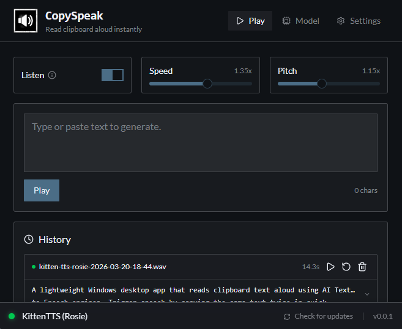

# CopySpeak

A lightweight Windows desktop app that reads clipboard text aloud using AI Text-to-Speech engines. Trigger speech by quickly copying the same text twice in a row. No more manual pasting or hotkey pressing!

### [Download Latest](https://github.com/ilyaizen/CopySpeak/releases)

**Current Version:** 0.0.4

## Screenshots



## Quick Start

```bash
bun install
bun run tauri dev
```

## Features

### Core

- **Multiple trigger modes**: Double-copy (1.5s window), hotkey, or manual paste/play
- **5 TTS engines**:
  - **Kitten TTS** (default) — Ultra-lightweight CPU-optimized ONNX inference, 8 built-in voices
  - **Piper TTS** — Local CLI engine with 20+ EN US voices
  - **Kokoro TTS** — Local CLI engine with multiple voices
  - **OpenAI TTS** — Cloud API with 9 voices
  - **ElevenLabs TTS** — Cloud API with voice library support
- **HUD overlay** — Floating heads-up display with real-time waveform visualization
- **History** — Persistent TTS generation history with playback and batch management

### Settings

- General: auto-start, debug mode, language (EN/ES with full i18n)
- Playback: speed (0.25x–4x), pitch (0.5x–2x), volume
- Triggers: double-copy window, hotkey configuration
- Sanitization: markdown stripping, text normalization
- Audio: output device selection, format conversion (MP3/OGG/FLAC)

### System

- **System tray** — Quick access controls
- **Auto-updater** — Check and install updates from GitHub Releases
- **Audio save mode** — Save TTS output to files
- **Dark/Light mode** — Brutalist design with theme support

## Tech Stack

| Component       | Technology                       |
| --------------- | -------------------------------- |
| Backend         | Rust (Tauri v2)                  |
| Frontend        | Svelte 5, TypeScript, Vite       |
| Package Manager | Bun v1.3                         |
| Audio           | rodio                            |
| UI              | shadcn-svelte, Tailwind CSS v4.2 |

## Project Structure

```
src/                     # Svelte 5 frontend
├── lib/
│   ├── components/      # UI components
│   └── utils.ts         # Utilities
└── routes/              # SvelteKit routes

src-tauri/src/           # Rust backend
├── main.rs              # Entry point
├── config/              # Persistence modules
├── commands/            # IPC handlers
├── clipboard.rs         # Double-copy detection
├── audio.rs             # Playback
├── tts/                 # TTS backends
└── sanitize/            # Text normalization
```

## Commands

```bash
bun run tauri dev        # Development server
bun run tauri build      # Production build
bun run check            # TypeScript/Svelte type check
bun run test             # Frontend tests (vitest)
cd src-tauri && cargo test  # Rust tests
```

## Changelog

See [CHANGELOG.md](./CHANGELOG.md) for recent changes.

## Contributing

We welcome contributions! Please see our [Contributing Guide](./docs/CONTRIBUTING.md) for details on how to get started, code style guidelines, and how to submit pull requests.

## License

MIT
