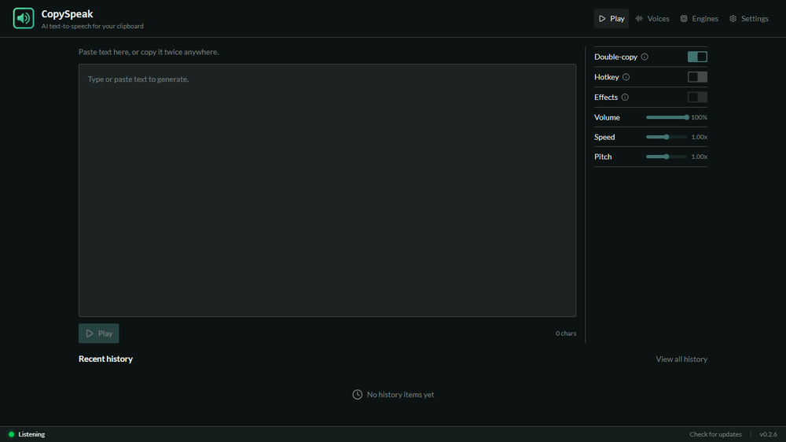

# CopySpeak

**Current Version:** 0.2.8

A modern desktop app that reads clipboard text aloud using AI Text-to-Speech engines. Trigger speech by quickly copying the same text twice in a row — works out of the box with no API key (Edge TTS is the default engine).

## [Download Latest](https://github.com/ilyaizen/CopySpeak/releases)



## Install

### Windows

1. Download `CopySpeak_<version>_x64-setup.exe` and run it (`.msi` also available).
2. On first launch, onboarding walks you through picking an engine and voice.
3. Updates: the app checks GitHub Releases automatically (or via **Check for updates** in the footer).

### Linux (x86_64)

Tested on Omarchy (Arch, Wayland); ships AppImage, `.deb`, and `.rpm`:

```bash
# AppImage
chmod +x CopySpeak_<version>_amd64.AppImage
./CopySpeak_<version>_amd64.AppImage

# Debian / Ubuntu
sudo apt install ./copyspeak_<version>_amd64.deb

# Fedora / openSUSE
sudo dnf install ./copyspeak_<version>_amd64.rpm
```

On Wayland compositors the HUD runs through XWayland and global hotkeys are protocol-impossible — trigger readings by double-copy, the tray, or a compositor keybind that POSTs to the local [control server](docs/profile-engine-settings.md).

### Browser companion (Chrome / Edge)

1. Install and start the desktop app first — the extension drives it.
2. Download `CopySpeak-Companion-<version>.zip` from the same release and extract it.
3. Open `chrome://extensions`, enable **Developer mode**, click **Load unpacked**, and select the extracted `dist` folder.
4. Open the extension's settings to grant per-site access, then select text and double-copy (or use the extension's toolbar button) to read it through the app.

## Quick Start

```bash
bun install
bun run tauri dev
```

## Features

### Core

- **Multiple trigger modes**: Double-copy (1.5s window), hotkey, or manual paste/play
- **13 TTS engines**:
  - **Local** — Piper, Kokoro, Kitten, Qwen3-TTS (multilingual, 9 CustomVoice voices), Pocket, or any CLI TTS tool via local subprocess
  - **Edge TTS** — Free Microsoft Edge Read Aloud backend (default)
  - **OpenAI TTS** — Cloud API with 9 voices
  - **ElevenLabs TTS** — Cloud API with voice library support
  - **Cartesia TTS** — Sonic 3.5 cloud API
  - **Google TTS** — Cloud API
  - **Microsoft TTS** — Azure Cognitive Services
  - **HTTP TTS** — Generic HTTP endpoint backend
- **HUD overlay** — Floating heads-up display with real-time waveform visualization and live word-highlighting captions
- **Live captions** — Word-level highlighting synced to the audio clock on the Play page, HUD, and browser companion, for engines that emit timing metadata
- **History** — Persistent TTS generation history with playback and batch management
- **Voice profiles** — Create, edit, and switch between named voice profiles with engine, voice, speed, pitch, and effects settings
- **Audio effects** — Walkie-talkie, 8-bit Game Boy, and more via OfflineAudioContext post-processing
- **LLM post-processing** — Optional Groq/AI rewrite pass that turns copied text into concise, listener-friendly speech
- **Engines page** — Dedicated per-engine setup with API key entry, local-engine installers, and test buttons

### Settings

- General: auto-start, debug mode, language
- Playback: speed (0.25x–4x), pitch (0.5x–2x), volume
- Effects: toggle and select audio effects
- Triggers: double-copy window, hotkey configuration
- Sanitization: granular markdown stripping toggles, text normalization
- Advanced: LLM post-processing, engine catalog
- Audio: output device selection, format conversion (MP3/OGG/FLAC)

### System

- **System tray** — Quick access controls
- **Browser companion** — Chrome/Edge extension to read your selection or hovered paragraphs through the app, with a context menu, status badge, and per-site permissions
- **Auto-updater** — Check and install updates from GitHub Releases
- **Control server** — Local HTTP server for external integrations (Pi, Claude Code, curl)
- **Pi & Claude Code extensions** — Speak AI assistant responses through CopySpeak
- **Audio save mode** — Save TTS output to files
- **Dark/Light mode** — Brutalist design with theme support

## Tech Stack

| Component       | Technology                     |
| --------------- | ------------------------------ |
| Platforms       | Windows, Linux (x86_64)        |
| Backend         | Rust (Tauri v2)                |
| Frontend        | Svelte 5, TypeScript, Vite     |
| Package Manager | Bun                            |
| Audio           | rodio                          |
| UI              | shadcn-svelte, Tailwind CSS v4 |

## Project Structure

```
src/                     # Svelte 5 frontend
├── lib/
│   ├── components/      # UI components
│   │   ├── effects-page.svelte
│   │   ├── engine/      # Engine settings
│   │   ├── history/     # History components
│   │   ├── hud/         # HUD overlay
│   │   ├── landing/     # Marketing landing page
│   │   ├── settings/    # Settings tabs
│   │   ├── ui/          # shadcn-svelte
│   │   ├── profiles-page.svelte
│   │   ├── play-page.svelte
│   │   └── ...
│   └── utils.ts         # Utilities (cn, portal action)
└── routes/              # SvelteKit routes
    ├── settings/        # Settings page
    ├── effects/         # Effects page
    ├── engines/         # Engine page
    ├── history/         # History page
    ├── voices/          # Voice profiles page
    ├── onboarding/      # First-run setup
    └── hud/             # HUD overlay

src-tauri/src/           # Rust backend
├── main.rs              # Entry point, IPC registration
├── config/              # Persistence modules
│   └── tts.rs           # TTS config types & engine enum
├── commands/            # IPC handlers
│   └── tts/             # Synthesis commands
├── tts/                 # TTS backend implementations
│   ├── edge.rs          # Edge TTS
│   ├── openai.rs        # OpenAI
│   ├── elevenlabs.rs    # ElevenLabs
│   ├── cartesia.rs      # Cartesia
│   ├── google.rs        # Google
│   ├── microsoft.rs     # Microsoft
│   ├── http.rs          # Generic HTTP
│   ├── cli.rs           # Local CLI engines
│   └── catalog.rs       # Engine catalog types
├── clipboard/           # Double-copy detection (win32 / wayland)
├── audio.rs             # Playback
├── post_process.rs      # LLM post-processing
└── sanitize/            # Text normalization
```

## Commands

```bash
# Development
bun run tauri dev           # Full app with hot-reload
bun run dev                 # Frontend only (port 5173)

# Build
bun run tauri build         # Production build

bun run check               # TypeScript/Svelte type checking
bun run check:watch         # Watch mode for type checking

# Testing (Frontend)
bun run test                # Run all frontend tests (vitest)
bun run test <name>         # Run single frontend test
bun run test:watch          # Watch mode

# Testing (Rust)
cd src-tauri && cargo test             # Run all Rust tests
cd src-tauri && cargo test <name>      # Run single Rust test
cd src-tauri && cargo check            # Type check Rust
cd src-tauri && cargo clippy           # Lint Rust

# Formatting
bun format                   # Biome + Prettier hybrid format

# Version Bumping
bun run bump                # Patch version bump (0.0.x)
bun run bump:minor          # Minor version bump (0.x.0)
bun run bump:major          # Major version bump (x.0.0)
```

## Changelog

See [CHANGELOG.md](./CHANGELOG.md) for recent changes.

## Contributing

We welcome contributions! Please see our [Contributing Guide](./docs/CONTRIBUTING.md) for details on how to get started, code style guidelines, and how to submit pull requests.

## License

MIT
